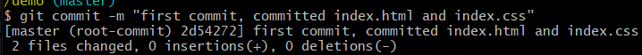

## git


> https://www.bilibili.com/video/BV1BE411g7SV?from=search&seid=10232875014974343077

### 指令
```
git init                        - 生成.git隐藏文件夹
git status / [filename]         - 查看文件状态
git add [filename]/.            - 文件变为staged状态(已暂存)
git commit -m "message"         - 0 insertions 0 deletions意思是没有代码增加也没有代码减少
git log                         - 查看日志 可以查询commit的哈希值


git reset [filename]            - 如果git add了一个文件 但是后悔了 在commit之前可以git reset
git reset [哈希值] --hard        - git commit后如果觉得之前的版本更好 那就git reset [哈希值] --hard (如果回到第2次 那么第2次之后的提交记录就消失了)
                                   如果又后悔了 想回到第3次 那么git reflog拿到哈希值 git reset [哈希值] 如果想回到当前分支之前的commit 直接git pull就行
```


### 文件状态
```
untracked                    - 新建的文件状态为untracked
staged                       - git add后变为staged
unmodified                   - git commit后变成unmodified
modified                     - 修改后git status查看就是modified

如果修改了两个文件 但是只add了一个 那么一个文件为staged 一个还是modified
```

### reset的三种模式
```
--hard                不保留所有变更
--soft                保留变更且变更内容处于staged
--mixed（默认）        保留变更且变更内容处于modified
```


### 分支
```
git checkout -b <name>[template]      - 创建新分支 name为新分支的名字 template以哪个分支为模板 如果template不填 则以当前所在的分支为模板 新分支继承了原来的分支的记录
git checkout master切换回master分支
git checkout <分支名字>可以切换分支
git branch查看左右分支
git merge <新分支名字>当前分支合并新分支（注意不是分支内容）
```

### 远程仓库
```
github建好了仓库后 复制SSH git@github.com:clareliu458/test-repository.git
git clone git@github.com:clareliu458/test-repository.git就可以拉取到本电脑

拉取到电脑后 创建新分支 然后修改文件后
git push发现有错误并提示 那就按照提示的来 （如果是本地建好的要首次推送到远程仓库 则git push git@github.com:clareliu458/test-repository.git）
git push --set-upstream origin apple推送到远程仓库
意思是把远程仓库的apple分支作为本地仓库的apple的上流分支 这时刷新git远程仓库就能看到多了个apple分支
再次推送到远程仓库git push就行了

另外一个同事想要切换到这个apple分支如下操作
git clone git@github.com:clareliu458/test-repository.git
cd test-repository
git fetch
git checkout apple

如果A同事的apple分支更新了又commit并且push到了远程仓库
B同事要拿到最新的直接git pull就行

另外要注意的是 如果分支是远程仓库的 要新建分支则
git checkout -b <name> origin <template> 实测进入该分支git checkout -b <name>即可
```


### 生成公钥
```
任意目录git bash命令行输入ssh-keygen -t rsa
一路回车下去 C:\Users\samla\.ssh文件夹就多了两个文件id_rsa.pub公钥和id_rsa私钥
把公钥的哈希值放在github即可
```


### 用户配置及修改
```
C:\Users\samla的.gitconfig文件
可以修改
```

### 设置用户名及邮箱
```
git config --global user.name "clareliu458"
git config --global user.email "samlau458@gmail.com"
```

### git两种创建目录的方式
```
1. git init                        - 初始化项目 根目录就多了.git文件夹
2. git clone url(远程仓库地址)      - 克隆远程仓库
```

### 忽略文件
```
前端比如node_modules文件夹是不用上传的 在根目录的.gitignore文件夹中写入
node_modules/

*.txt                           - 忽略所有txt文件
!kimi.txt                       - kimi.txt
/kimi                           - kimi文件夹里的内容忽略 当时其子目录中的文件不忽略
kimi/                           - 忽略该文件夹
doc/*.txt                       - 会忽略doc/notes.txt但不会忽略doc/server/arch.txt
```


### git常用命令
```
git add
git commit
git push
git status
git branch
git merge
git pull
git fetch
git log
git reflog
git clone
git reset
git rebase*
git cherry-pick*
git stash*
git remote*
觉得难记可以去设置alias git安装目录mingw64里文件夹里的etc文件夹的gitconfig文件设置
例如

[alias]
  s = status

怎么知道git安装在哪里？CMD输入where git
```

