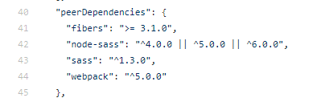
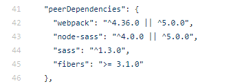
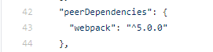
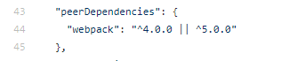

#### vue项目中使用sass


##### 1. 安装sass-loader

```json
npm i xxx -D
"node-sass": "^4.2.0",
"sass-loader": "^10.1.1",
"style-loader": "^2.0.0"
```


##### 2. src/assets/scss文件夹下创建index.scss，作为入口文件引入其他scss文件

```scss
@import './reset';
@import './base';
@import './iconfont';
```


##### 3. main.js中引入入口文件index.scss

```js
import '@/assets/scss/index.scss'
```


##### 4. style标签的lang属性值设置为scss

```html
<style lang="scss">
$height: 200px;
.parent {
  height: $height;
  background: #f44;
}
</style>
```


#### 可能会遇到版本不匹配问题，如何解决？

1. 先去github搜sass-loader，发现最新版本的sass-loader只支持webpack5，webpack那就是Vue3了



2. 于是sass-loader版本往下找，找到能支持webpack4的。同时也找到对应的node-sass版本了



3. 然后再去github搜style-loader，查看最新版本，发现只支持webpack5



4. 那就往下找，找到支持webpack4的为止



