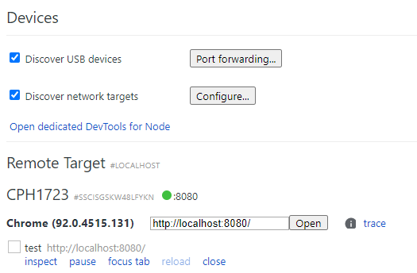

> https://www.jianshu.com/p/95d523aeea02

#### chrome真机调试

- 优点：简单快捷
- 缺点：只能调试手机端的chrome浏览器，对于UC，QQ这些浏览器均不适用

1. usb线连接到电脑，手机打开开发者模式，打开usb调试，打开谷歌浏览器
2. 电脑谷歌浏览器输入chrome://inspect，勾选"discovery usb device"
3. 输入地址，open即可，手机就会同时打开一样的界面。点击inspect，电脑窗口就打开新窗口显示手机界面。需要注意的是127.0.0.1这样地址不支持，就是vscode自带的live-server。需要用npm把项目跑起来http://localhost:8080/这种才支持（第一次不行的话就关掉再试几次inspect）。

#### wenire真机调试

以后再说

#### spy-debugger真机调试

以后再说